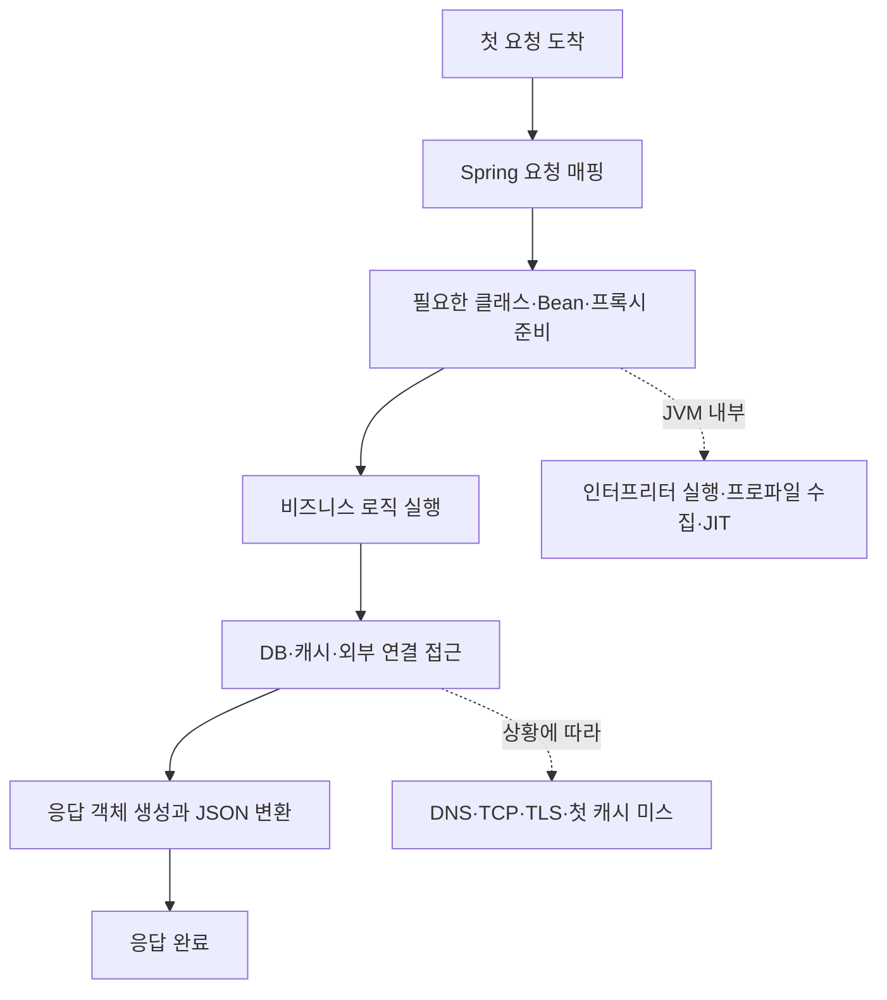

# 1부. 첫 요청이 느린 범인은 JIT 하나가 아니다

> 상태: 초안

배포는 끝났다. 헬스 체크는 초록불이고 CPU도 멀쩡하다.

그런데 첫 요청은 800ms가 걸리고, 같은 요청을 몇 번 보내면 30ms가 된다. 이 장면에서 가장 쉬운 결론은 "JVM 워밍업이 덜 됐나 보다"다.

하지만 첫 요청과 100번째 요청의 차이를 전부 JIT 탓으로 돌리면 원인을 잘못 찾을 수 있다. **첫 요청이 느리다는 사실만으로는 JIT가 범인인지 알 수 없다.** 이 글은 그 이유를 분해하고, Spring
Boot 실험으로 확인한다.

## 첫 요청의 지연에는 세 개의 시계가 있다

"첫 요청이 느리다"는 하나의 현상에는 서로 다른 세 종류의 시간이 겹친다.

| 구분         | 무슨 일이 일어나는가                         | JIT와의 관계   |
|------------|-------------------------------------|------------|
| 프로세스 시작    | JVM 실행, 클래스패스 탐색, 초기 클래스 로딩         | 간접적        |
| 애플리케이션 초기화 | Spring Bean·프록시, DB·Redis 연결, 캐시 생성 | 대부분 별개     |
| JVM 워밍업    | 인터프리터 실행, 프로파일 수집, JIT 컴파일          | 이번 시리즈의 핵심 |

DB 연결이 느린데 JIT 옵션을 조정하거나, 아직 한 번도 사용하지 않은 요청 경로의 초기화 비용을 JIT 문제로 오해할 수 있다. 반대로 서버가 기동됐다고 해서 주요 요청 경로의 성능까지 안정된 것도 아니다.

JVM 워밍업은 서버가 켜질 때 생기는 모든 문제의 이름이 아니다. 반복 실행되는 코드에 대한 런타임 데이터를 모으고, 필요하면 더 빠른 기계어로 바꾸는 과정이다.

## Ready와 warmed up은 다르다

| 상태        | 의미                                   |
|-----------|--------------------------------------|
| Started   | JVM 프로세스가 실행됐다.                      |
| Ready     | 애플리케이션이 요청을 받을 수 있다고 판단했다.           |
| Warmed up | 주요 요청 경로가 반복 실행되어 성능이 안정된 상태에 가까워졌다. |

readiness는 "요청을 처리할 수 있다"는 신호이지, "응답 시간이 이미 안정됐다"는 보장은 아니다.

## 첫 요청에는 어떤 비용이 겹칠까

이 그림은 대표적인 요청 경로다. 클래스 로딩과 JIT 컴파일은 다른 작업과 겹치거나 지연될 수 있으므로, 매번 이 순서로 직렬 실행된다는 뜻은 아니다.

첫 요청에는 필요한 클래스와 Spring 구성 요소의 첫 사용, JSON 변환기 준비, DB 접근, 외부 연결, 캐시 미스, JVM의 인터프리터 실행과 프로파일 수집이 함께 들어갈 수 있다. 따라서 첫 요청의
770ms는 하나의 비용이 아니라, 아직 하지 않았던 여러 작업의 합계일 가능성이 높다.

## Spring Boot에서 먼저 확인할 것

실험 앱은 요청 경로를 네 종류로 나눈다.

| API                              | 역할                           |
|----------------------------------|------------------------------|
| `GET /experiments/cpu`           | 외부 I/O 없이 계산만 수행한다.          |
| `GET /experiments/serialization` | 응답 객체를 반환해 JSON 변환 경로를 관찰한다. |
| `GET /experiments/database`      | 첫 JPA 접근과 쿼리 실행 경로를 관찰한다.    |
| `GET /experiments/mixed`         | 계산·DB 조회·JSON 변환을 함께 수행한다.   |

`/mixed`는 실제 서비스와 가까운 관찰 대상이다. 나머지 세 경로는 느린 시간이 어디에서 생기는지 좁히기 위한 대조군이다.

애플리케이션을 새로 시작한 뒤 각 API를 1회, 2회, 10회, 100회 호출했다. 아래는 한 측정 실행의 결과다.

| API              |        1회 |      2회 |     10회 |    100회 |
|------------------|----------:|--------:|--------:|--------:|
| `/cpu`           |  66.087ms | 2.095ms | 1.165ms | 1.312ms |
| `/serialization` |  77.395ms | 2.416ms | 1.725ms | 1.402ms |
| `/database`      | 365.064ms | 4.157ms | 2.474ms | 3.299ms |
| `/mixed`         | 374.393ms | 4.309ms | 3.635ms | 2.609ms |

첫 호출만으로 특정 원인을 확정할 수는 없다. 특히 `/database`와 `/mixed`의 큰 첫 호출에는 JPA·Hibernate 경로의 첫 사용과 DB 작업이 후보로 보이지만, 공통 초기화 비용까지 포함됐을 수
있다.

## 비용은 API를 따라가지 않고 첫 요청을 따라간다

그래서 API 실행 순서를 바꿨다. 공통 초기화 비용이라면, 느린 시간이 특정 API에 고정되지 않고 **먼저 실행한 요청**으로 이동해야 한다.

| API              | A 실행 순서: cpu → serialization → database → mixed |        시간 | B 실행 순서: mixed → database → serialization → cpu |        시간 |
|------------------|-------------------------------------------------|----------:|-------------------------------------------------|----------:|
| `/cpu`           | 1번째                                             |  64.076ms | 4번째                                             |   1.881ms |
| `/serialization` | 2번째                                             |  17.607ms | 3번째                                             |   4.226ms |
| `/database`      | 3번째                                             | 300.683ms | 2번째                                             |   4.582ms |
| `/mixed`         | 4번째                                             |   3.802ms | 1번째                                             | 344.656ms |

`/mixed`는 A 순서에서 마지막 호출일 때 3.802ms였지만, B 순서에서 첫 호출이 되자 344.656ms가 됐다. 이 결과가 보여주는 것은 `/mixed` 자체가 항상 느리다는 사실이 아니다.

**첫 요청 지연에는 해당 API의 고유 비용뿐 아니라, 그 요청이 먼저 부담한 공통 초기화 비용도 들어간다.** 따라서 첫 요청 하나의 시간만 보고 "이 API가 느리다" 또는 "JIT이 문제다"라고 결론 내리면
안 된다.

## 측정 환경

- JDK: Amazon Corretto 21.0.9+10 LTS
- JVM 옵션: 프로젝트에서 별도 `jvmArgs`, `JAVA_TOOL_OPTIONS`, `JDK_JAVA_OPTIONS`를 설정하지 않았다. JVM 기본 G1 GC를 사용했다.
- 운영체제: Windows 11 Pro, 10.0.26200, 64비트
- CPU: AMD Ryzen 7 5800X, 8코어 / 16 논리 프로세서, 최대 3.801GHz
- 애플리케이션: Spring Boot 4.1.1, Java 21 toolchain, H2 인메모리 DB

이 숫자는 위 환경에서 얻은 한 번의 측정값이다. 운영 서비스의 지연 시간이나 비율을 그대로 대변하지 않는다.

## 정리

첫 요청이 느리다고 해서 JIT만 탓하면 안 된다. 프로세스 시작, 애플리케이션 초기화, JVM 워밍업은 서로 다른 비용이며, 실제 요청에서는 이들이 겹칠 수 있다.

이번 실험에서는 느린 시간이 특정 API에 고정되지 않고 먼저 실행한 요청으로 이동했다. 따라서 먼저 해야 할 일은 JIT 튜닝이 아니라, 첫 요청의 비용을 공통 초기화와 요청 경로 고유 비용으로 분리하는 것이다.

다음 편에서는 Java 코드가 바이트코드로 시작해 인터프리터로 실행되고, 어떤 조건에서 JIT 컴파일 대상이 되는지 살펴본다.
