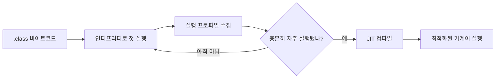

# 2부. Java 코드는 처음에 어떻게 실행되는가

> 상태: 초안

1부에서 첫 HTTP 요청이 느리다고 해서 그 시간을 전부 JIT 탓으로 볼 수 없다는 것을 확인했다. 그렇다면 JIT는 정확히 언제, 어떤 코드에 개입할까?

답을 이해하려면 먼저 Java 메서드가 실행 내내 같은 모습으로 동작하지 않는다는 사실부터 잡아야 한다.

## `javac`가 만든 것은 CPU가 바로 실행하는 코드가 아니다

Java 소스 파일을 컴파일하면 `.class` 파일이 만들어진다. 이 파일 안에는 CPU별 기계어가 아니라 JVM이 읽는 **바이트코드(bytecode)** 가 들어 있다.

```text
Calculator.java
  → javac
Calculator.class (바이트코드)
  → JVM이 실행 시 해석하거나 컴파일
CPU가 실행하는 기계어
```

그래서 "Java는 컴파일 언어인가, 인터프리터 언어인가"라는 질문에는 둘 다가 답이다. 빌드할 때는 소스 코드를 바이트코드로 컴파일하고, 실행할 때 JVM은 그 바이트코드를 우선 실행 가능한 형태로 처리한다.

## 메서드를 처음 호출하면 JVM은 먼저 읽고 준비한다

아래 계산 메서드를 보자.

```java
public long calculate(int size) {
    long result = 0;
    for (int i = 0; i < size; i++) {
        result += (long) i * i;
    }
    return result;
}
```

이 메서드가 처음 필요해지면 JVM은 `Calculator` 클래스를 찾아 읽고, 필요한 연결과 초기화 작업을 수행한다. 그 뒤 메서드의 바이트코드를 실행한다.

이 단계는 "JIT 컴파일이 끝났다"는 뜻이 아니다. 클래스를 읽고 실행할 수 있는 상태가 되는 일과, 반복해서 실행한 경로를 더 빠른 기계어로 최적화하는 일은 다르다.

## 처음에는 인터프리터가 빠르게 출발시킨다

JVM은 모든 메서드를 시작하자마자 기계어로 만들지 않는다. 우선 인터프리터(interpreter)가 바이트코드 명령을 읽어 실행한다.

인터프리터의 장점은 기다리지 않고 바로 실행할 수 있다는 것이다. 대신 반복문을 많이 돌거나 같은 메서드를 계속 호출하면, 명령을 매번 해석하는 비용이 쌓인다.

동시에 JVM은 실행 데이터를 모은다. 이 메서드가 얼마나 자주 호출되는지, 반복문이 얼마나 많이 도는지, 어느 분기로 자주 가는지 같은 정보다. 이 정보가 없으면 어떤 코드를 비싼 비용을 들여 최적화할지 판단하기
어렵다.



## JIT는 같은 메서드를 다른 코드로 바꾼다

JIT(Just-In-Time) 컴파일러는 자주 실행되는 메서드나 반복문을 골라, 현재 CPU에서 실행할 기계어를 만든다. 이후 호출은 인터프리터 대신 이 컴파일된 코드를 탈 수 있다.

중요한 점은 Java 코드가 바뀌는 것이 아니라 **실행 경로가 바뀐다**는 것이다. 개발자는 계속 `calculate(100_000)`을 호출하지만 JVM 내부에서는 다음과 같은 변화가 일어날 수 있다.

```text
첫 호출       → 바이트코드를 해석하며 실행
반복 호출     → 호출 횟수와 분기 정보를 수집
충분히 뜨거움 → JIT가 기계어 생성
이후 호출     → 생성한 기계어를 실행
```

이 변화가 1부에서 말한 JVM 워밍업의 한 부분이다. 다만 Spring 애플리케이션의 첫 요청은 이 변화만 겪는 것이 아니다. `DispatcherServlet` 초기화, JSON 변환기 준비, DB 접근처럼
JVM 바깥의 애플리케이션 초기화도 같은 요청에 겹칠 수 있다.

## 직접 바이트코드를 확인해 보자

프로젝트 루트에서 아래 명령을 실행하면 `Calculator`의 바이트코드를 볼 수 있다.

```powershell
.\gradlew.bat :core:classes
javap -c core\build\classes\java\main\dev\warmup\core\Calculator.class
```

출력의 `iload`, `lmul`, `ladd`, `goto` 같은 명령은 CPU 기계어가 아니라 JVM이 실행할 바이트코드다. JVM은 이 명령을 처음에는 해석해 실행하고, 충분히 자주 실행되는 경로는 나중에
기계어로 컴파일할 수 있다.

여기서 바이트코드를 전부 외울 필요는 없다. 이번 확인의 목적은 소스 코드와 CPU 기계어 사이에 JVM이 실행하는 중간 단계가 실제로 있다는 점을 보는 것이다.

## 다음 질문: JVM은 무엇을 "자주 실행된다"고 판단할까?

모든 메서드를 미리 JIT 컴파일하면 시작이 느려지고, 거의 호출되지 않는 코드까지 컴파일하느라 CPU를 낭비한다. JVM은 그래서 실행 횟수와 반복 횟수 같은 런타임 정보를 바탕으로 컴파일 대상을 고른다.

다음 편에서는 JVM이 메서드 호출과 반복문의 실행 횟수를 어떻게 관찰하고, 어떤 코드를 hot code로 판단하는지 살펴본다.
